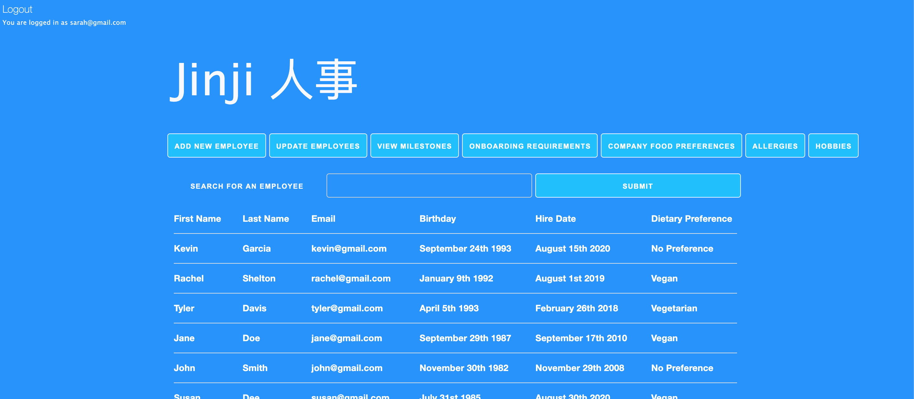
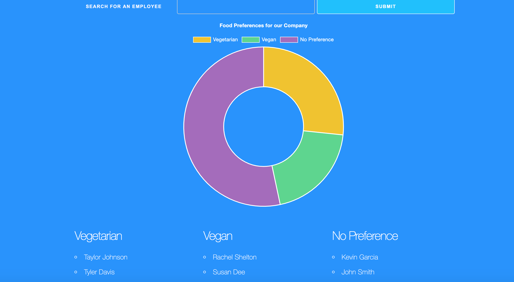
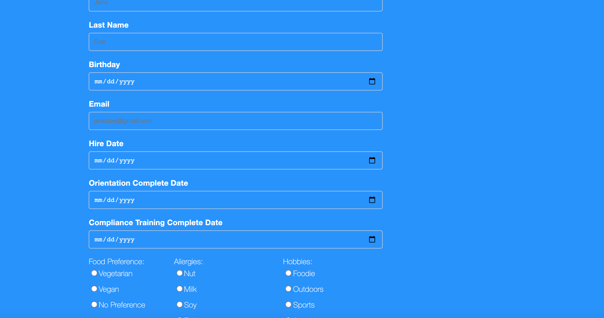

# Jinji

By skerr924, MikChanna, ploymahloy

# Description

Jinji is an application designed for Human Resource professionals and other leaders in management positions who want to foster a more social, inclusive environment for their employees. It provides data on employee preference, interests, etc to inform decisions about how to connect employees to each other, plan meaningful and inclusive events, and recognize employees for upcoming milestones.

# Table of Contents

- [Jinji](#jinji)
- [Description](#description)
- [Table of Contents](#table-of-contents)
- [Installation](#installation)
- [Usage](#usage)
- [License](#license)
- [Testing](#testing)
- [Contributing](#contributing)

# Installation

Run an npm install to ensure all required modules are installed before usage.

# Usage

This application is designed to be simple and user-friendly.

Home page: 

Sample chart: 

New employee form: 

This application is deployed on Heroku and can be visited here: https://stark-waters-09218.herokuapp.com/.

Use "guest@gmail.com" and the password "1234" to login to the guest account.

# License

No additional licenses are needed for this application.

# Testing

There is currently no testing set up for this application.

# Contributing

When contributing to this project, please add clear and concise comments to all added code to ensure my and future users' understanding of additions and changes.
